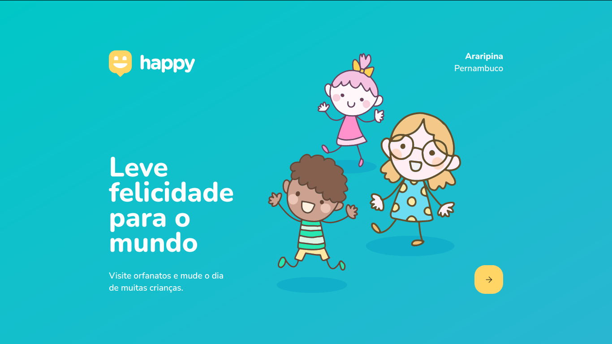
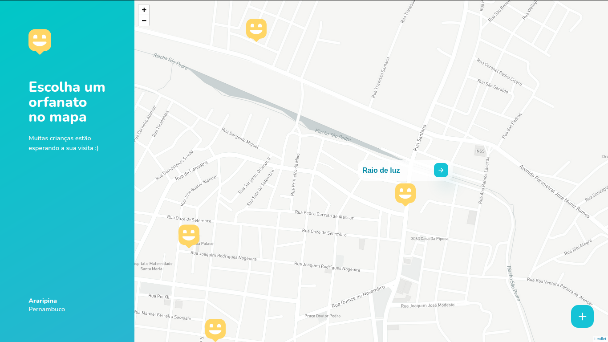
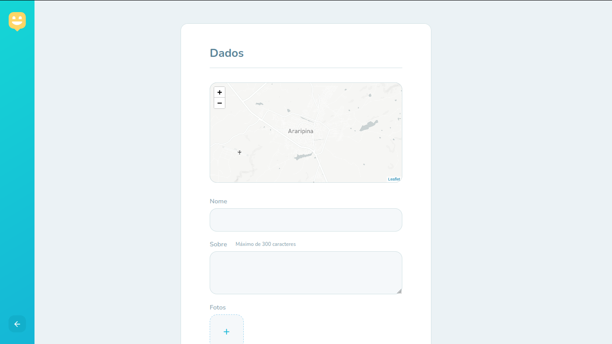
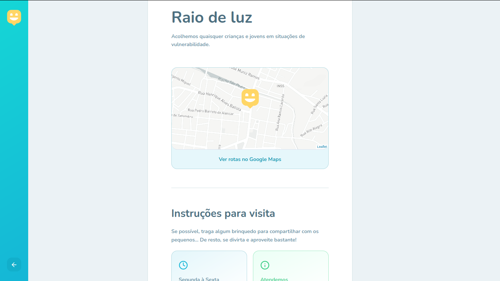

<p align="center">

  

  <a href="https://github.com/Daniel-Alencar/web-of-Happy">
    
  </a>
  
  

  <a href="https://github.com/Daniel-Alencar/web-of-Happy/network">
    
  </a>

  <a href="https://github.com/Daniel-Alencar/web-of-Happy/stargazers">
    
  </a>
  
</p>

<h1 align="center">
  Happy
</h1>

<p align="center">
 <a href="#objetivo">Objetivo</a> •
 <a href="#layout">Layout</a> • 
 <a href="#features">Features</a> • 
 <a href="#pré-requisitos">Pré-requisitos</a> • 
 <a href="#rodando-o-back-end">Back-end (servidor)</a> • 
 <a href="#rodando-a-aplicação-web">Aplicação web</a> • 
 <a href="#tecnologias">Tecnologias</a> • 
 <a href="#autor">Autor</a>
</p>

### Objetivo

<p align="center"> Este projeto foi feito através da NLW3 da Rocketseat, o qual visa facilitar a busca por instituições de abrigo para crianças e adolescentes em situações de vulnerabilidade.</p>

### Layout

<p align="center">
  <h1 style="display: flex;">
    
    
    
    
  </h1>
</p>

### Features

- [x] Página inicial do Happy
- [x] Visualização dos orfanatos em um mapa
- [x] Cadastro de orfanato
- [x] Detalhes do orfanato
- [x] Configurar o README
- [ ] Visual responsivo para telas menores
- [ ] Substituição do mapa do Leaflet por o mapa do google maps
- [ ] Acesso restrito
- [ ] Recuperação de senhas
- [ ] Novo modo de cadastro dos orfanatos (com confirmação do administrador da aplicação)
- [ ] Localização real do usuário
- [ ] Cadastro em múltiplas etapas
- [ ] Logout da aplicação
- [ ] Deploy da aplicação

<p align="center">Mandem sugestões de novas features :blush:<p/>


### Pré-requisitos

Antes de começar, você vai precisar ter instalado em sua máquina as seguintes ferramentas:
[Git](https://git-scm.com), [Node.js](https://nodejs.org/en/) ou [Yarn](https://yarnpkg.com/). 
Além disto é bom ter um editor para trabalhar com o código como [VSCode](https://code.visualstudio.com/).

### Rodando o back end

Vá para o [repositório do servidor](https://github.com/Daniel-Alencar/backend-of-Happy) e siga os passos amostrados no README.

### Rodando a aplicação web

```bash
# Clone este repositório
$ git clone <https://github.com/Daniel-Alencar/web-of-Happy>

# Acesse a pasta do projeto no terminal/cmd
$ cd web-of-Happy

# Instale as dependências
$ npm install
ou
$ yarn install

# Execute a aplicação
$ npm start
ou
$ yarn start

# O servidor inciará na porta:3000 (acesse <http://localhost:3000>)
```

### Tecnologias

As seguintes ferramentas foram usadas na construção do projeto:

- [Node.js](https://nodejs.org/en/)
- [Yarn](https://yarnpkg.com/)
- [React](https://pt-br.reactjs.org/)
- [TypeScript](https://www.typescriptlang.org/)

### Autor
---


Feito por Daniel Alencar 👋🏽 Entre em contato!

[](https://www.instagram.com/daniel_alencar_/) [](https://www.linkedin.com/in/Daniel746/) [](mailto:danielalencar746@gmail.com)
